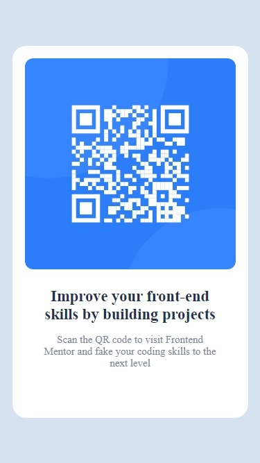

# Frontend Mentor - QR code component solution

This is a solution to the [QR code component challenge on Frontend Mentor](https://www.frontendmentor.io/challenges/qr-code-component-iux_sIO_H). Frontend Mentor challenges help you improve your coding skills by building realistic projects. 

## Table of contents

- [Overview]			
  - [Screenshot]
  - [Links])
- [My process]
  - [Built with]
  - [What I learned]
  - [Continued development]
  - [Useful resources]
- [Author]

## Overview

### Screenshot




### Links

- Solution URL: [https://github.com/zidantech/qr-code-component]
- Live Site URL: [Add live site URL here]

## My process

### Built with

- Semantic HTML5 markup
- CSS custom properties
- Flexbox
- CSS Grid

### What I learned

Got to learn more on CSS grids.

To see how you can add code snippets, see below:

```html
<div class=container></div>
```
```css
.container {
    background-color: blue;
    width: 50px;
    height: 50px;
    border-radius:25px;
  }
```
```js
const proudOfThisFunc = () => {
  console.log('🎉')
}
```

### Continued development

Use this section to outline areas that you want to continue focusing on in future projects. These could be concepts you're still not completely comfortable with or techniques you found useful that you want to refine and perfect.


### Useful resources

- [Example resource 1](https://www.example.com) - This helped me for XYZ reason. I really liked this pattern and will use it going forward.
- [Example resource 2](https://www.example.com) - This is an amazing article which helped me finally understand XYZ. I'd recommend it to anyone still learning this concept.


## Author

- Website - [Add your name here](https://www.your-site.com)
- Frontend Mentor - [@zidantech](https://www.frontendmentor.io/profile/zidantech)
- Twitter - [@yourusername](https://www.twitter.com/yourusername)

